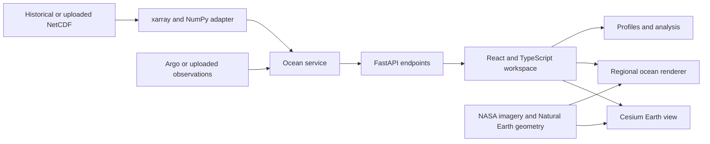

# OceanTwin

### From global ocean observations to explainable local insight

OceanTwin is an interactive ocean data intelligence platform developed for **Smart India Hackathon problem statement SIH26067**. It unifies measured float profiles, historical ocean-model fields, satellite chlorophyll, depth, time, and scientific analysis in one visual workspace.

Users begin with the Earth, select a real observation, descend into its surrounding water column, compare measurement and model profiles, and analyze the active ocean field. The prototype runs locally in one Python process and includes its presentation dataset, imagery, and geographic assets for reliable offline demonstration.

> **Submission dataset:** historical HYCOM temperature, salinity, and velocity fields for 11–13 February 2026; NASA Aqua MODIS February 2026 surface chlorophyll; and 54 measured Core Argo profiles with quality-control and source provenance. The bundled workspace is a reproducible historical snapshot, not a live forecast.

## The challenge

Ocean information is commonly separated across NetCDF grids, instrument profiles, satellite products, coordinates, depth levels, and timestamps. This fragmentation makes it difficult for researchers, planners, educators, and decision-makers to answer simple but important questions:

- What is happening at this location, depth, and time?
- How does a measured profile compare with the surrounding model field?
- Which values are measured, model-derived, or satellite-observed?
- Can a new scientific dataset be inspected without building a new visualization pipeline?

OceanTwin connects those questions in a single evidence-aware workflow.

## What OceanTwin delivers

### Earth-to-ocean exploration

- Interactive Cesium globe with locally bundled NASA Blue Marble imagery.
- Global Argo observation markers across the Indian, Atlantic, and Pacific oceans.
- Smooth transition from a selected float to a regional top-down or angled ocean view.
- Named geographic context for India, the Arabian Sea, Bay of Bengal, surrounding seas, and ocean basin.
- Independent Earth imagery and scientific overlay controls.

### Depth, time, and physical fields

- Temperature, salinity, satellite chlorophyll, and derived current speed.
- Continuous display-depth selection across 36 source levels down to 2,000 metres.
- Three historical model frames with playback and timeline scrubbing.
- Depth slices, sampled volume rendering, current vectors, streamlines, and isosurfaces.
- Variable-aware colour ranges, palettes, opacity, logarithmic scaling, and vertical exaggeration.

### Measurements and scientific analysis

- Measured Core Argo temperature and salinity profiles with WMO number, cycle, timestamp, data mode, QC status, and GDAC source link.
- Model–observation collocation at the instrument coordinates and measured depths.
- Calculated RMSE, MAE, bias, matched levels, and model-time offset.
- Water-column profile probes for all supported fields.
- Fixed-depth great-circle transects.
- Regional mean, minimum, maximum, median, and standard deviation.
- Explicit separation of measured Argo variables, satellite chlorophyll, and model-derived currents.

### Validated data ingestion

- Upload and inspect compatible NetCDF datasets without restarting the application.
- Coordinate alias detection, unit normalization, missing-value handling, and bounded decoding.
- Automatically generated model-inspection stations for uploaded ocean areas.
- CSV, TSV, and semicolon-delimited observation profile ingestion.
- Transactional failure handling: an invalid upload does not replace the active workspace.

## Why the prototype stands out

| Capability | OceanTwin approach |
| --- | --- |
| Scientific integrity | Source labels remain visible; unsupported values and coastal gaps stay missing. |
| Explainability | Measurements, model values, satellite products, and derived quantities are clearly distinguished. |
| End-to-end workflow | Ingestion, visualization, comparison, and analysis run in one application. |
| Presentation reliability | The production viewer, imagery, geographic context, and historical data work locally without venue connectivity. |
| Extensibility | Dataset adapters, analysis services, API routes, and renderers are separated for future data sources. |
| Safety and bounds | Upload size, decoded-memory limits, coordinates, dimensions, calendars, and units are validated before activation. |


## System architecture



### Technology

- **Frontend:** React 19, TypeScript, Cesium, Three.js, React Three Fiber, Recharts, Vite
- **Backend:** Python, FastAPI, xarray, NumPy, SciPy, pandas, netCDF4
- **Data formats:** NetCDF, JSON, GeoJSON, CSV/TSV
- **Deployment:** single local Python process serving the API and optimized frontend

## Quick start

OceanTwin uses one setup command and one runtime entry point. The application serves the optimized interface and API together at `http://127.0.0.1:8000/`.

### Requirements

- Python 3.12 or newer; Python 3.13 is tested.
- Node.js 22 LTS and npm.
- A WebGL-capable browser with hardware acceleration.
- Internet access during first-time dependency installation only.

### Windows

From the repository root:

```powershell
python setup_project.py
.\.venv\Scripts\python.exe run.py
```

Open [http://127.0.0.1:8000/](http://127.0.0.1:8000/).

### macOS and Linux

```bash
python3 setup_project.py
./.venv/bin/python run.py
```

The setup command creates an isolated Python environment, installs locked backend dependencies, installs deterministic frontend dependencies with `npm ci`, prepares local Cesium assets, and builds the optimized interface. Subsequent launches only require `run.py`.

### Evaluation routes

- **Presentation entry:** `http://127.0.0.1:8000/`
- **Direct scientific workspace:** `http://127.0.0.1:8000/?explore`
- **Interactive API contract:** `http://127.0.0.1:8000/docs`

## Verification

```text
# Windows
.\.venv\Scripts\python.exe -m pytest -q
npm --prefix frontend test
npm --prefix frontend run format:check
npm --prefix frontend run build

# macOS / Linux
./.venv/bin/python -m pytest -q
npm --prefix frontend test
npm --prefix frontend run format:check
npm --prefix frontend run build
```

The backend suite covers dataset metadata, interpolation, temporal changes, currents, API validation, uploads, rollback behavior, periodic coordinates, dateline transects, profiles, comparisons, and regional statistics. Frontend checks cover geographic interpolation, periodic seams, coastline gaps, masking, and isosurface geometry.

## API summary

| Endpoint | Purpose |
| --- | --- |
| `GET /api/datasets` | Active dataset metadata and provenance |
| `GET /api/ocean/slice` | Variable at a selected depth and time |
| `GET /api/ocean/volume` | Bounded depth-resolved field |
| `GET /api/currents` | Eastward and northward current field |
| `GET /api/ocean/inspect` | Interpolated values at a coordinate |
| `GET /api/ocean/profile` | Full model water-column profile |
| `GET /api/ocean/region` | Regional field, currents, coastline, and observations |
| `GET /api/ocean/transect` | Fixed-depth great-circle transect |
| `GET /api/ocean/stats` | Statistical summary for a selected region |
| `GET /api/observations/{id}` | Observation metadata and measurements |
| `GET /api/compare/{id}` | Model–observation profiles and metrics |
| `POST /api/datasets/upload` | Validate and activate a NetCDF dataset |
| `POST /api/observations/upload` | Validate and activate observation profiles |
| `POST /api/datasets/real-argo` | Restore the bundled historical workspace |

## Scientific scope

OceanTwin keeps its claims aligned with the supplied evidence:

- The bundled fields are a historical HYCOM analysis, not a live operational forecast.
- Core Argo profiles provide measured temperature and salinity; they do not supply the displayed chlorophyll or current speed.
- Chlorophyll is a February 2026 monthly satellite surface composite and has no fabricated subsurface values.
- Current speed is derived from model velocity components; animated particles are a directional visual aid.
- Comparisons use finite overlapping samples and report `model - observation` statistics.
- The regional vertical scale is deliberately exaggerated and labelled for exploration.
- Global floats outside the Indian Ocean model window remain available as measured profiles without unsupported model comparison.
- Transects are fixed-depth paths, and regional statistics are equally weighted grid-cell summaries.

## Repository guide

```text
backend/                  FastAPI application, adapters, services, data, and tests
frontend/src/             React workspace, globe, ocean renderer, charts, and controls
frontend/public/          Bundled Earth imagery, geography, and Cesium assets
frontend/scripts/         Scientific rendering checks and asset preparation
data_sources/             Preserved provider subsets and prepared upload sample
docs/                     Validation, provenance, presentation, and recording guides
run.py                    Single-process application entry point
setup_project.py          Reproducible local setup
```

## Roadmap

The current release proves the complete local workflow. Future production work includes live provider ingestion, operational forecast provenance, authentication, deployment monitoring, area-weighted regional statistics, broader grid support, OGC interoperability, and domain review for decision-support use.
